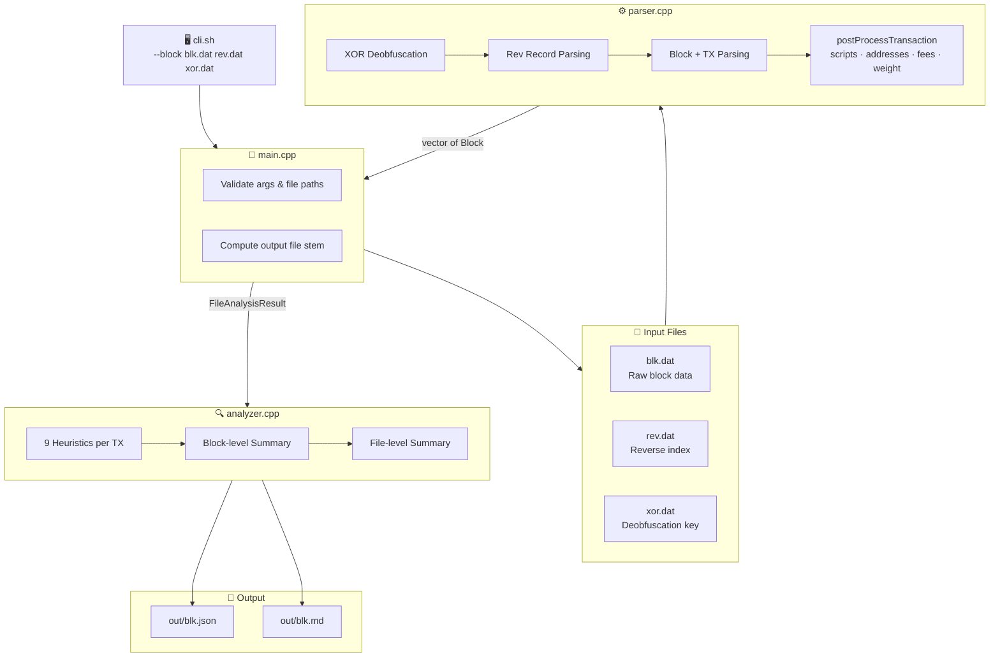
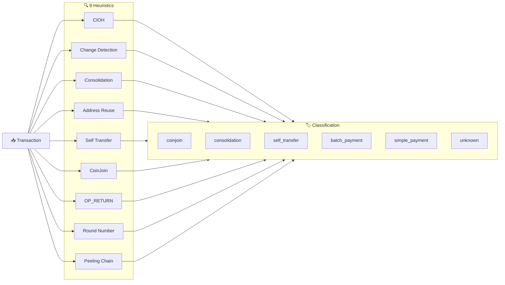

# Approach

---

## Heuristics Implemented

### 1. Common Input Ownership Heuristic (CIOH)

**What it detects:**
The basic assumption is that in a multi-input transaction, all inputs are owned by a single entity. Meaning, when a wallet lacks a single UTXO large enough to cover a payment, it combines multiple UTXOs (all the addresses from each UTXO is referred as Co-Spent Address) -- all of which require the corresponding private keys to sign. As we know, private keys are rarely shared, co-spending strongly suggest single-entity ownership.

**How it is detected/computed:**
Any transaction with more than 1 input (vin.size() >= 2) is flagged. The input addresses are collected and reported as likely co-owned. The returned output is `{ "detected" : true/false, input_count : Total Number of inputs, addresses : [list of all the addresses likely belonging to the same entity] }`

**Confidence model:**
Confidence is assigned using a logarithmic scale: min(1.0, log(input_count) / log(50)). Log scale is chosen because confidence gains are largest in the early inputs — going from 2 to 3 inputs is more meaningful than going from 48 to 49. Beyond 50 inputs, confidence saturates at 1.0. If CoinJoin patterns are also detected on the same transaction, CIOH confidence is considered unreliable since CoinJoin is a deliberate multi-party construction designed to break this assumption.

**Limitations:**
 - CoinJoin transactions are the primary false positive — multiple independent users co-sign, violating the single-entity assumption.
     Improvement: cross-check with CoinJoin detection and downgrade CIOH confidence when CoinJoin patterns are present.
 - Multisig wallets can also produce multi-input transactions that don't imply single ownership.
     Improvement: detect multisig script patterns (e.g. P2SH, P2WSH with OP_CHECKMULTISIG) and exclude or flag separately.
 - No confidence threshold is applied — all multi-input transactions are flagged, which may overcount in blocks with high CoinJoin activity.
     Improvement: apply a minimum confidence cutoff (e.g. skip flagging if confidence < 0.3).
 - The confidence model uses a fixed saturation threshold of 50 inputs. 
     Improvement: segregate transactions by type (SegWit vs legacy) and derive a dynamic threshold based on total input bytes and max block weight, giving a more accurate upper bound per transaction.

---

### 2. Change Detection

**What it detects:**
The UTXO model forces wallets to spend whole UTXOs -- since exact payment amounts are rarely available, the excess value is returned to the sender as "change." Change detection identifies which output in a transaction is likely this change output, rather than the actual payment. This is valuable because linking the change output back to the sender allows an analyst to continue tracing funds across transactions.

**How it is detected/computed:**
The heuristic uses script_type match as a mandatory gate -- if no output shares a script type with any input, detection is skipped. Within that gate, three additional conditions are checked and are additive: address match (output address matches an input address, common in older wallets), round number (non-round outputs in sats are more likely change), and index match (change is commonly at output index 1). Each condition that fires is recorded in a methods array.

**Confidence model:**
Confidence is driven by how many conditions fired: 1 → low, 2 → medium, 3 → high, 4 → very_high. Script type match alone gives low confidence since it is a necessary but weak signal on its own. All four conditions firing gives very high confidence.

**Limitations:**
 - Script type hard gate: If input/output script types differ, change is missed entirely. 
     Improvement: fall back to value-based analysis — the output closest in value to total_inputs - payment - fee is likely change, regardless of script type.
 - Address match rarely fires: Modern wallets always generate fresh change addresses. 
     Improvement: use BIP32 derivation path patterns or known wallet fingerprints to identify fresh change addresses.
 - Fixed 100K sat threshold: Only catches round amounts at one scale — e.g. 100,000 sats (0.001 BTC) is flagged but 1,000 sats (0.00001 BTC) is missed entirely. 
     Improvement: check divisibility at multiple thresholds (1K, 10K, 100K, 1M sats) and weight confidence by which granularity matched.
 - Index assumption: Change at position 1 is wallet-dependent. 
     Improvement: build a per-wallet index preference model by observing patterns across multiple transactions from the same address cluster.

---

### 3. Consolidation Detection

**What it detects:**
Identifies transactions where many inputs are merged into 1-2 outputs. This is a common wallet maintenance operation -- users consolidate many small UTXOs into fewer larger ones, typically during low-fee periods.

**How it is detected/computed:**
Flagged when vin.size() >= 5 && vout.size() < 3. Confidence is assigned based on script type consistency: if all inputs share the same script type → very_high, if the output script type matches input script type → medium, otherwise → low.

**Confidence model:**
 - very_high: all inputs same script type (strong wallet fingerprint)
 - medium: output matches input script type
 - low: mixed script types, structural match only

**Limitations:**
 - Threshold of 5 inputs is arbitrary -- a 4-input consolidation is missed.
     Improvement: make the threshold dynamic based on the block's average input count.
 - Mixed-script consolidations (e.g. post-migration) are underconfident.
     Improvement: treat script type diversity as a separate signal rather than a confidence reducer.

---

### 4. Address Reuse

**What it detects:**
Detects when the same address appears in both inputs and outputs of a transaction (within-tx reuse), or across multiple transactions in the same block (cross-tx reuse). Address reuse strongly links transactions to the same entity and weakens privacy.

**How it is detected/computed:**
A seen_addresses set is maintained across all transactions in a block and reset per block. For within-tx reuse, input addresses are checked against output addresses. For cross-tx reuse, any address already in seen_addresses that reappears is flagged.

**Confidence model:**
Address reuse is a binary signal -- either the address reappears or it doesn't. No graduated confidence is applied since reuse is a deterministic observation, not probabilistic.

**Limitations:**
 - seen_addresses resets per block — reuse across blocks is not tracked.
     Improvement: maintain a global address set across the entire file analysis.
 - Intentional reuse (e.g. donation addresses) produces false positives.
     Improvement: cross-reference with known public addresses to filter intentional reuse.

---

### 5. Self Transfer Detection

**What it detects:**
Identifies transactions where all inputs and outputs appear to belong to the same entity -- no obvious payment component exists. Common in wallet reorganization or internal fund movements.

**How it is detected/computed:**
Flagged when all inputs share the same script type, all outputs share the same script type, input and output script types match, and no round number outputs exist. Coinbase transactions are skipped.

**Confidence model:**
Self transfer is treated as a binary detection -- the conditions are strict enough that confidence is implicitly high when all conditions are met.

**Limitations:**
 - Round number check as a disqualifier may incorrectly exclude legitimate self transfers where amounts happen to be round.
     Improvement: use multiple round number thresholds rather than a single binary check.
 - Single input/output transactions that meet script type conditions may be misclassified.
     Improvement: require a minimum of 2 outputs to distinguish from simple payments.

---

### 6. CoinJoin Detection

**What it detects:**
Identifies CoinJoin transactions -- coordinated multi-party transactions designed to obscure the transaction graph by mixing inputs from different owners and producing equal-value outputs.

**How it is detected/computed:**
Flagged when vin.size() >= 3, 2+ outputs share equal value (tracked via a value frequency map), and 3+ unique input addresses exist. Equal-value outputs are the strongest CoinJoin signal.

**Confidence model:**
CoinJoin detection is binary. The three conditions together form a strong enough signal that graduated confidence is not applied.

**Limitations:**
 - Equal-value outputs can appear in batch payments that are not CoinJoins.
     Improvement: add entropy analysis — CoinJoins tend to have higher input/output count symmetry.
 - Minimum thresholds (3 inputs, 2 equal outputs) may miss small CoinJoins.
     Improvement: lower thresholds with additional corroborating signals.

---

### 7. OP_RETURN Analysis

**What it detects:**
Detects outputs with OP_RETURN scripts, which are used to embed arbitrary data in the blockchain. Classifies the embedded data by protocol -- Omni Layer, OpenTimestamps, or unknown.

**How it is detected/computed:**
Any output with script_type == "op_return" is flagged. The embedded data is decoded and matched against known protocol prefixes to classify the protocol.

**Confidence model:**
Protocol classification is deterministic -- prefix matching is exact. If no known prefix matches, the protocol is marked unknown.

**Limitations:**
 - Only Omni and OpenTimestamps protocols are currently recognized.
     Improvement: expand the protocol prefix table to cover more protocols (e.g. Counterparty, Stacks).
 - Arbitrary data without a known prefix is opaque.
     Improvement: apply entropy analysis to distinguish structured vs random embedded data.

---

### 8. Round Number Payment

**What it detects:**
Identifies outputs whose values are round numbers in satoshis (divisible by 100,000). Round-number outputs are more likely to be payments; non-round outputs are more likely to be change.

**How it is detected/computed:**
For each non-OP_RETURN output, checks if value_sats % 100000 == 0. All matching output indices are collected and reported.

**Confidence model:**
Binary detection per output. No graduated confidence since round number is a deterministic check.

**Limitations:**
 - Fixed 100,000 sat threshold misses round amounts at other granularities.
     Improvement: apply multiple thresholds and report which granularity matched.
 - Round amounts in fiat (e.g. exactly $10 worth of BTC) are not captured.
     Improvement: incorporate historical exchange rate data to detect fiat-round amounts.

---

### 9. Peeling Chain Detection

**What it detects:**
Identifies peeling chain patterns -- a series of transactions where a large input is split into one small output (payment) and one large output (change), with the large output repeatedly spent in subsequent transactions following the same pattern. Common in mixing services and automated payment processors.

**How it is detected/computed:**
A transaction is a peeling candidate when it has exactly 1 input and 2 outputs, with a large/small output ratio >= 3x. Cross-block UTXO tracking is maintained via a peeling_candidates map (txid:vout → value) and a txid_to_chain map to link hops. After all blocks are processed, chains with fewer than 2 hops are filtered out and results are sorted by hop count descending.

**Confidence model:**
Chain length drives confidence -- longer chains are less likely to occur by coincidence. A 2-hop chain is weak signal; a 10+ hop chain is a strong indicator of automated or deliberate peeling behavior.

**Limitations:**
 - Cross-file peeling chains are missed — chains that span multiple .blk files are truncated.
     Improvement: persist the UTXO candidate map across file analyses.
 - The 3x ratio threshold may miss peeling chains with more balanced splits.
     Improvement: make the ratio threshold configurable or learned from data.
 - Single-input requirement misses peeling chains where the sender occasionally consolidates before peeling.
     Improvement: relax to allow 1-2 inputs with the same large/small output ratio condition.

---

## Architecture Overview

### Stack
Sherlock is built in **C++17** with a flat file structure — no CMake or complex build system. Third-party libraries used:
- **nlohmann/json** — JSON serialization and output
- **picosha2** — SHA256 hashing for transaction and block ID computation
- **sipa/bech32** — Bech32/Bech32m encoding for SegWit and Taproot addresses
- **utf8.h** — UTF-8 validation for OP_RETURN data decoding

The project compiles to a single binary `block_parser` via `setup.sh`.

### System Architecture

### File Responsibilities

| File | Role | Key Functions |
|------|------|---------------|
| `main.cpp` | Entry point & orchestrator | arg parsing, calls `parseAllBlocks`, `analyzeBlocks`, `writeBlockOutput`, `generateMarkdownReport` |
| `parser.cpp` | Raw block & transaction parser | `parseAllBlocks`, `parseTransaction`, `postProcessTransaction`, `parseAllRevRecords` |
| `analyzer.cpp` | Heuristics engine & output writer | `analyzeBlocks`, all 9 heuristic functions, `writeBlockOutput`, `generateMarkdownReport` |
| `bech32.cpp` | Address encoding | Bech32 / Bech32m encoding for P2WPKH, P2WSH, P2TR |
| `json.hpp` | JSON serialization | nlohmann/json — used throughout analyzer for output |
| `picosha2.h` | SHA256 hashing | Block and transaction ID computation |
| `opcodes.h` | Bitcoin script opcodes | Script classification and ASM decoding |
| `utf8.h` | UTF-8 validation | OP_RETURN data decoding and protocol classification |

### Heuristics Pipeline

### Data Flow Narrative

**Parsing Phase:** `cli.sh` invokes the `block_parser` binary with `--block` mode and three file paths. `main.cpp` validates the arguments, then calls `parseAllBlocks()` in `parser.cpp`. The raw bytes of all three files are read into memory — the XOR key from `xor.dat` is applied to deobfuscate both `blk.dat` and `rev.dat`. Rev records are parsed first via `parseAllRevRecords()` to build a prevout lookup table. Blocks are then parsed sequentially — magic bytes, block size, header, and all transactions. Each transaction goes through `postProcessTransaction()` which fills prevouts, classifies script types, derives addresses, computes fees and weight.

**Analysis Phase:** `main.cpp` passes the complete `vector<Block>` to `analyzeBlocks()` in `analyzer.cpp`. Every transaction in every block is run through all 9 heuristics independently. Results are aggregated into per-block summaries and then into a file-level `FileAnalysisResult` struct. Peeling chains are resolved after all blocks are processed since they require cross-block UTXO tracking.

**Output Phase:** The `FileAnalysisResult` is passed to `writeBlockOutput()` which serializes the full analysis to `out/<blk_stem>.json`, and to `generateMarkdownReport()` which produces a human-readable `out/<blk_stem>.md` covering all blocks, heuristic findings, fee rate stats, and peeling chains.

### Web Visualizer

The web layer consists of an **Express.js backend** and a **React + Vite frontend**, connected via a REST API.

**Backend (`web/server.js`):**
- `GET /api/health` — health check for grader
- `GET /api/results` — lists available pre-analyzed block files from `out/`
- `GET /api/results/:stem` — serves committed JSON analysis for instant loading
- `POST /api/analyze` — accepts raw `.dat` file uploads via multer, invokes `block_parser --ui` as a child process, streams results back to the frontend

**Frontend (`web/client/`):** React + Tailwind + shadcn/ui with three tabs:
- **Overview** — block count, transaction stats, fee rate distribution, script type chart
- **Explorer** — expandable block list with per-block heuristic findings
- **Heuristics Lab** — 3×3 interactive heuristic grid with transaction drill-down, confidence badges, and peeling chain graph

**Dual-mode design:** The UI operates in two modes — default mode serves pre-analyzed committed results from `out/` instantly without any wait, while upload mode accepts raw `.dat` files, triggers the C++ engine via `--ui` mode, and returns enriched results including full transaction arrays for all blocks and peeling chain data. This separation keeps the CLI pipeline grader-safe while giving the UI richer data.

**`--ui` mode vs `--block` mode:**
- `--block` — writes `out/*.json` and `out/*.md`, transactions only for `blocks[0]`
- `--ui` — prints enriched JSON to stdout, transactions for all blocks, includes peeling chains

---

## Trade-offs and Design Decisions

### System-Level Decisions
1. Parser / Analyzer Separation:
`parser.cpp` handles raw byte parsing, `analyzer.cpp` handles heuristics. Keeping them separate allows the parser to be reused across projects and the analyzer to be extended without touching parsing logic. 
2. Single-Pass Processing:
All heuristics, fee stats, and script distributions are collected in a single traversal — O(n) in transactions. This avoids re-scanning blocks at the cost of slightly more complex accumulation logic inside the loop.
3. JSON Output Scoping:
All blocks are fully parsed and analyzed, but the transactions array is only written to JSON for blocks[0]. Subsequent blocks use []. This keeps output size manageable for the grader — full arrays across 84 blocks would produce 100MB+ files. All analysis_summary fields still aggregate across every block. This was prompted by grader timeout constraints with large JSON files.
4. Flat File Structure:
No CMake or Makefile — all source files compile to a single binary via setup.sh. For a project of this size, a complex build system adds overhead without benefit.

### Heuristic-Level Decisions
1. Heuristic Independence:
Each heuristic runs independently — no result influences another's execution. This keeps them easy to reason about and extend. Minor redundancy (e.g. CIOH and CoinJoin both examine input counts) is an acceptable trade-off for clarity.
2. Confidence Model Design:
CIOH uses logarithmic scaling, change detection uses a 4-tier additive model, and deterministic heuristics (address reuse, OP_RETURN, round number) are binary. A uniform model would either oversimplify nuanced heuristics or over-engineer simple ones.
3. Cross-Block UTXO Tracking for Peeling Chains:
A peeling_candidates map persists across all blocks since peeling chains rarely complete within a single block. Memory usage grows with candidate UTXO count but remains bounded and manageable for this dataset.
4. Classification Priority Ordering:
Priority follows `coinjoin > consolidation > self_transfer > batch_payment > simple_payment > unknown` — decreasing structural interestingness. A transaction gets one label, which loses some nuance but keeps reports and the UI clean.
5. Conservative Thresholds
`CoinJoin (≥3 inputs, ≥2 equal outputs)` and `Consolidation (≥5 inputs, ≤2 outputs)` thresholds are deliberately conservative. For a chain analysis tool, a false positive is more damaging than a false negative.

---

## References
- Meiklejohn et al. (2013) — A Fistful of Bitcoins: https://cseweb.ucsd.edu/~smeiklejohn/files/imc13.pdf
- Ghesmati et al. (2021) — Bitcoin Privacy Attacks: https://eprint.iacr.org/2021/1088.pdf
- OXT Research — Chain Analysis and Transaction Privacy: https://21ideas.org/en/privacy/oxt-1/
- Bitcoin Wiki — Privacy: https://en.bitcoin.it/wiki/Privacy
- Bitcoin Wiki — Blockchain attacks on privacy: https://en.bitcoin.it/wiki/Privacy#Blockchain_attacks_on_privacy
- Kappos et al. (2022) — An Empirical Analysis of Privacy in Bitcoin: https://www.usenix.org/conference/usenixsecurity22/presentation/kappos
- CryptoQuant — Introduction to Bitcoin Heuristics: https://medium.com/cryptoquant/introduction-to-bitcoin-heuristics-487c298fb95b
- Claude (Anthropic) — used for research assistance: https://claude.ai
